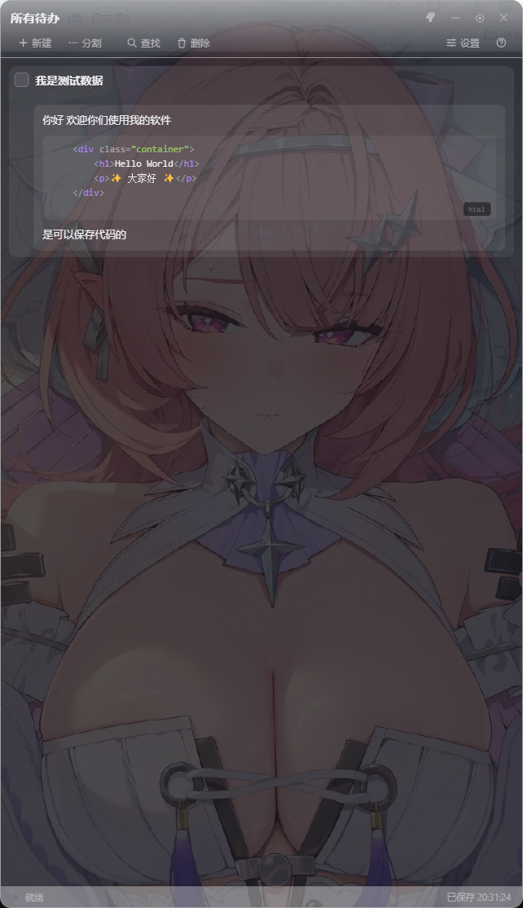
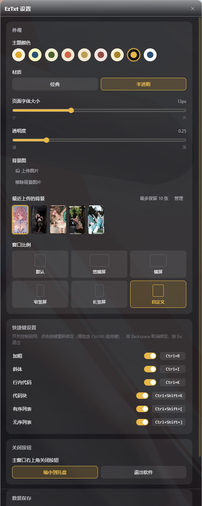

# EzTxt Sticky Notes

<div align="center">

**Language: [简体中文](README.md) | English**

</div>

<div align="center">

**Desktop To-Do · Markdown Notes · Floating Ball**

An Electron-based local to-do and Markdown notes app: to-do cards + WYSIWYG Markdown notes, a draggable edge-snapping floating ball, theme / material / background customization, and a separate settings window.


</div>





---

## 📌 Table of Contents

- [✨ Features](#-features)
- [🖥️ Tech Stack](#️-tech-stack)
- [🚀 Quick Start](#-quick-start)
- [🎮 Usage](#-usage)
- [⌨️ Keyboard Shortcuts](#️-keyboard-shortcuts)
- [📦 Project Structure](#-project-structure)
- [⚙️ Data & Configuration](#️-data--configuration)
- [🔨 Build & Release](#-build--release)
- [🗓️ Changelog](#️-changelog)
- [📄 License](#-license)

---

## ✨ Features

### To-Do List
- **Card-based to-do list**: create / edit / check off / delete, with batch selection and a two-step delete confirmation
- **Divider grouping**: insert dividers with optional titles to organize tasks into sections
- **Real-time search & filter**: filter tasks by keyword from the top search bar
- **Auto-save**: global debounced auto-save (2s), `Ctrl+S` saves immediately, best-effort save on close

### WYSIWYG Markdown Notes
- Every card has an expandable **Notes** area for WYSIWYG Markdown editing (`marked` render + `turndown` serialize, lossless round-trip)
- **Code block syntax highlighting** (highlight.js): JavaScript / TypeScript / Bash / SQL / C# (.NET) / Java / Python / Vue and more
- Language badge auto-shown at the bottom-right of each code block
- Typora-style code block input: type ` ```language ` + Enter to create a block; Enter adds a newline inside, Enter on an empty line exits
- Pasting images embeds them as base64; pasting multi-line code keeps a single code block

### Floating Ball (Mini Ball)
- One-click collapse into a **desktop floating ball** from the toolbar, or drag the window to a screen edge to snap
- Shows the pending count; click to expand, drag to move
- **macOS Genie-style scale animation**: content shrinks toward the top-right on collapse, expands from the edge nearest the ball on release
- The ball always uses the classic solid theme color, independent of the window material

### Personalization
- **11 theme colors**: Amber / Deep Blue / Olive / Terracotta / Gold / Rose / Sage / Pure Black / Pure White / Remilia (pink-purple) / Remilia Night (deep purple)
- **Window materials**: Classic (opaque) / Translucent; Acrylic (frosted glass) reserved
- **Background image**: custom background with adjustable opacity, keeping the last 10 uploads
- **Font size**: page base font-size slider
- **Window ratio**: Default / Wide Landscape / Landscape / Narrow Portrait / Tall Portrait + **Custom size** (enter width & height in a dialog, live-synced with the main window)

### System Integration
- **System tray**: closes to tray by default; tray menu shows / quits; the close-button behavior can be switched in settings (minimize to tray / quit app)
- **Always on top**: `Ctrl+Shift+T`
- **Separate settings window**: appearance / shortcuts / close behavior / data location all managed here
- **Customizable data location**: default local `data/` (dev) or `userData/storage` (packaged), switchable with data migration
- **Editor shortcuts**: bold / italic / inline code / code block / ordered / unordered list, toggleable and rebindable
- **Clean uninstall**: terminates the running process and cleans caches on uninstall, keeping only to-do data

---

## 🖥️ Tech Stack

| Layer | Tech |
| --- | --- |
| Desktop framework | [Electron](https://www.electronjs.org/) 31.x (contextIsolation + preload bridge) |
| Markdown render | [marked](https://github.com/markedjs/marked) 13.x |
| HTML → Markdown | [turndown](https://github.com/mixmark-io/turndown) 7.x |
| Code highlighting | [highlight.js](https://highlightjs.org/) 11.x |
| Packaging | [electron-builder](https://www.electron.build/) 24.x (NSIS / Portable) |
| Styling | Vanilla CSS (design spec in `docs/UI-DESIGN-SPEC.md`) |

> Note: the renderer uses `contextIsolation` with `sandbox: false`; all Node capabilities (marked / turndown / highlight.js / IPC) are wrapped in preload and exposed via `window.api` — the renderer never touches Node modules directly.

---

## 🚀 Quick Start

### Requirements

- [Node.js](https://nodejs.org/) ≥ 18
- [npm](https://www.npmjs.com/) (or pnpm / yarn)
- Windows 10 / 11 (packaging targets Windows x64)

### Install & Run

```bash
# 1. Clone the repository
git clone <your-repo-url>
cd easy-txt

# 2. Install dependencies
npm install

# 3. Run in development (with logging)
npm start
# or
npm run dev
```

> In mainland China, see the mirror config in `.npmrc` (electron / electron-builder binaries via npmmirror).

### Development

```bash
npm run dev          # electron . --enable-logging
npm run gen:icon     # regenerate app icons (src/icon.ico / icon.png)
```

---

## 🎮 Usage

### Basics
1. **New task**: click the "New" button in the toolbar or press `Ctrl+N`, type a title and press Enter
2. **Check / delete**: click the checkbox on the left to complete; "Delete" enters batch mode, then confirm to remove selected cards
3. **Notes**: click the expand arrow on the right of a card and type Markdown in the editor — WYSIWYG
4. **Dividers**: click "Split" in the toolbar to insert a group divider with an optional title
5. **Collapse to ball**: click "Shrink" in the toolbar to collapse the window into a floating ball (dragging to a screen edge also snaps)
6. **Settings**: click "Settings" in the toolbar to open the separate settings window

### Data Storage
- Default data dir: `data/` in the project (dev), `%APPDATA%\EzTxt\storage` (packaged)
- Data files: `note.json` (to-dos), `settings.json` (settings)
- In **Settings → Data Storage** you can view the current location, open the folder, and change the storage dir (auto-migrates data)

---

## ⌨️ Keyboard Shortcuts

| Shortcut | Action |
| --- | --- |
| `Ctrl+S` | Save now |
| `Ctrl+N` | New task |
| `Ctrl+Shift+T` | Toggle always-on-top |
| `Ctrl+B` / `Ctrl+I` / `Ctrl+K` | Bold / Italic / Inline code |
| `Ctrl+D` | Strikethrough (~~text~~, toggle on/off) |
| `Ctrl+Shift+[` / `Ctrl+Shift+]` | Ordered / Unordered list |
| `Ctrl+Shift+K` | Code block |
| `` ```language `` + `Enter` | Create a code block (e.g. ` ```js `, ` ```python `) |
| `Enter` | Continue list items; newline inside code blocks; exit an empty code-block line |
| `Shift+Enter` | Soft line break |
| `Tab` / `Shift+Tab` | Indent / outdent |
| `Backspace` | Delete the selected task (when not typing, with confirmation) |
| `Ctrl+Z` | Undo note editing (custom snapshot stack with caret position restore) |
| `Ctrl+Shift+Z` / `Ctrl+Y` | Redo note editing |
| `Ctrl+/` | Toggle the shortcut help panel |

> Editor shortcuts can be toggled and rebound individually in **Settings → Shortcuts** (must include Ctrl/Alt modifiers).

---

## 📦 Project Structure

```
easy-txt/
├── src/                     # App source
│   ├── main.js              # Electron main process: windows/tray/snap/storage/IPC
│   ├── preload.js           # preload: marked/turndown/highlight.js wrappers + contextBridge
│   ├── renderer.js          # Main-window renderer: to-do list + WYSIWYG editor
│   ├── index.html           # Main window page
│   ├── settings.html        # Separate settings window page
│   ├── settings.js          # Settings window logic
│   ├── styles.css           # Global styles (themes/materials/editor/scrollbars etc.)
│   ├── custom-theme.*       # Custom theme color window (html/js)
│   ├── mini-gifs/           # Mini-ball animated GIFs (remi-1~6.gif, Remilia themes)
│   ├── icon.ico / icon.png  # App icons
│   └── logo-0829-1.*        # Original logo assets (not packaged)
├── scripts/
│   ├── gen-icon.js          # Icon generation script
│   ├── after-pack.js        # Post-pack hook (inject icon via rcedit)
│   ├── uninstaller.nsh      # Custom NSIS uninstaller (clean caches, keep data)
│   └── rcedit-x64.exe       # Icon injection tool
├── docs/
│   └── UI-DESIGN-SPEC.md    # UI design spec
├── data/                    # Dev-mode data dir (auto-generated)
├── dist/                    # Build output dir (auto-generated)
├── .npmrc                   # npm mirror config
└── package.json
```

---

## ⚙️ Data & Configuration

Settings (`settings.json`):

| Key | Description |
| --- | --- |
| `theme` | Theme color key |
| `material` | Window material: `opaque` (classic) / `translucent` / `acrylic` (reserved) |
| `acrylicBlur` | Acrylic frosted intensity (reserved) |
| `bgImage` / `bgHistory` | Current background / last 10 background history (dataURL) |
| `bgOpacity` | Background opacity |
| `fontSize` | Page base font size (px) |
| `closeAction` | Close-button behavior: `tray` (minimize to tray) / `quit` (exit app) |
| `windowSize` / `customWindowSize` | Window-ratio preset / custom size |
| `shortcuts` | Editor shortcuts (enabled flags & key bindings) |

---

## 🔨 Build & Release

```bash
npm run dist           # Build NSIS installer + Portable (win x64)
npm run dist:portable  # Portable only
npm run dist:nsis      # NSIS installer only
```

Outputs to `dist/`:

- `EzTxt-<version>-x64.exe` (NSIS installer)
- `EzTxt-<version>-x64-portable.exe` (portable)

> On uninstall, the installer runs a custom NSIS script to terminate the running process and clean cache dirs (Cache / logs etc.), **keeping your to-do data** (the `storage` folder).

---

## 🗓️ Changelog

### 2026-08-30

**Code blocks & editing**
- **Syntax highlighting** for code blocks (highlight.js): JavaScript / TypeScript / Bash / SQL / C# (.NET) / Java / Python / Vue and more
- **Language badge** auto-shown at the bottom-right of each code block (from ` ```language `)
- **Strikethrough** `~~text~~` support (lossless `marked` + `turndown` round-trip), shortcut **`Ctrl+D`**
- Strikethrough uses high-contrast red and stays visible after losing focus (no longer relies on the browser keeping `<del>`)
- Collapsed note preview (next to the to-do title) no longer shows `~~` source, only plain text
- Note editor **max-height removed**: content grows freely and the card expands with it

**Shortcut settings**
- New **strikethrough shortcut** (default `Ctrl+D`), toggleable / rebindable in settings
- New **Reset to default shortcuts** button (one-click restore)
- New **shortcut conflict detection**: shows a notice, restores the previous binding, and does not save when a combo is taken
- Fixed shortcut capture issues (modifier-only mis-binding / IME interference / Ctrl+Backspace treated as clear)

**Window & appearance**
- **Window ratio presets**: Default / Wide Landscape / Landscape / Narrow Portrait / Tall Portrait (dashed-box preview)
- **Custom window size**: enter width & height in a dialog, live-synced with the main window (auto-updates while dragging)
- Window materials: Classic (opaque) / Translucent (Acrylic reserved, temporarily hidden)
- **Close-button behavior** setting: minimize to tray / quit app, tooltip follows the setting
- Mini-ball **mouse passthrough**: transparent area around the ball no longer blocks clicks (reaches apps below), restores interaction on hover
- Mini-ball expand/collapse uses macOS Genie-style scale animation; the ball always uses the classic solid theme color

**System integration**
- **Auto-update** (electron-updater + GitHub Releases): auto-check on launch, "Software Update" section in settings showing version / check / progress / one-click install
- **Clean uninstall**: custom NSIS script terminates the process and clears caches, keeping only to-do data

### 2026-09-01

**Sorting & task management**
- **Drag to reorder**: drag handle on the left of each card (HTML5 DnD) to reorder to-dos; auto-disabled during search filter to avoid accidental drags
- Dragging highlights the target position; release to save the new order

**Editing**
- Strikethrough supports **toggle on/off**: if the caret is inside a strikethrough, `Ctrl+D` unwraps it back to plain text; otherwise it wraps the selection
- **Custom theme colors**: a separate window to adjust colors (background / accent / text etc.), name and save to apply to the main window immediately; supports managing & switching multiple custom themes

**Themes & system**
- New **"Remilia"** theme (soft pink + lavender purple, light) and **"Remilia Night"** theme (deep purple + pink-purple highlights, dark)
- Mini-ball **hides the taskbar icon**: while collapsed to the mini ball, EzTxt is hidden from the taskbar (tray icon only); restored on expand

**Mini-ball upgrades**
- New mini-ball **animated style**: uses 4 uncompressed animated GIFs in rotation (only on Remilia / Remilia Night themes); in animated mode the numeric badge is hidden and the ball is a pure GIF; the animated ball is **square** (no image cropping)
- Mini-ball **single-click** expands the main window; dragging moves the ball

### 2026-09-03

**Editor undo/redo**
- Notes editor now supports **`Ctrl+Z` undo** / **`Ctrl+Shift+Z` (or `Ctrl+Y`) redo** with a custom snapshot stack (per-editor instance, up to 50 steps)
- Undo/redo **restores caret position** to the offset at the time of the action — no more jumping to the first line
- Formatting actions (bold / strikethrough / code block etc.) push a snapshot immediately; continuous typing is debounced (600ms) into one step

**Delete confirmation**
- `Backspace` on a selected task now shows a **confirmation dialog** with the task title; `Enter` to confirm / `Esc` to cancel

**Mini-ball typing-detection GIF**
- Mini-ball animated mode adds **global keyboard monitoring** (main-process PowerShell `GetAsyncKeyState`) — detects typing even when focus is in another app
- Slow typing (key interval > 450ms) → switches to `remi-5.gif`; fast & sustained (interval < 250ms for > 1.5s) → switches to `remi-6.gif`; reverts to normal rotation after 2s pause
- PowerShell process is persistent (started on app launch), per-key edge detection + `readline` line-by-line parsing; auto-restarts 3s after a crash

**GIF display fix**
- Fixed visual size inconsistency when switching between GIFs of different aspect ratios (portrait remi-1~4 / square remi-5 / landscape remi-6): changed `background-size` from `cover` to `100% 100%` for uniform stretching

---

## 📄 License

This project is open-sourced under the [MIT License](./LICENSE).

---

<div align="center">

**Made with ❤️ by EzTxt**

</div>
